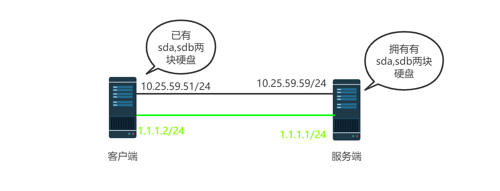

### 实验拓扑

**PS:默认网络通，防火墙已经关闭**




### 1. 配置iSCSI服务端

#### 1.1 安装软件包

```
yum -y install targetcli  
```


#### 1.2  配置iscsi

```bash
1.给sdb分区
parted -s /dev/sdb mklabel msdos  
parted -s /dev/sdb mkpart primary 1 5G
parted  /dev/sdb align-check optimal 1       #显示1 aligned为正常，分区对齐


targetcli   回车
1.创建后端卷（后备卷）
cd  /backstores/block   
  create dev=/dev/sdb1 name=iscsi_store_test

2.创建全局唯一标识名
cd  /iscsi
  create iqn.2017-08.com.example:system1 

3.创建lun
cd  /iscsi/iqn.2017-08.com.example:system1/tpg1/luns
  create /backstores/block/iscsi_store_test

4.创建acL
cd  /iscsi/iqn.2017-08.com.example:system1/tpg1/acls   #此服务只能被system2访问
    create iqn.2017-08.com.example:system2
***这个iqn是客户端的

5.创建portals
cd  /iscsi/iqn.2017-08.com.example:system1/tpg1/portals
  delete 0.0.0.0 3260
  create 10.25.59.59 
  create 1.1.1.1

6.保存退出
cd /
saveconfig 
exit
```


#### 1.3 启动服务

```
systemctl restart target  && systemctl enable target
```


### 2. 配置iSCSI客户端

#### 2.1 安装软件

```
yum -y install iscsi-initiator-utils device-mapper-multipath
```


#### 2.2 修改/etc/iscsi/iscsid.conf

(可选，调优项)

```
vim /etc/iscsi/iscsid.conf
node.session.timeo.replacement_timeout=1    #指网络出现问题，多长时间通知上层
node.session.cmds_max=512					
node.session.queue_depth=512
```


#### 2.3 修改客户端iqn

```
vim  /etc/iscsi/initiatorname.iscsi
InitiatorName=iqn.2017-08.com.example:system2
```


#### 2.4 客户端扫描存储

```
man  iscsiadm /EXAMPLES
iscsiadm --mode discoverydb --type sendtargets --portal 10.25.59.59:3260 --discover
```


#### 2.5 客户端添加存储

```
iscsiadm --mode node  --targetname  iqn.2017-08.com.example:system1  --portal  1.1.1.1:3260  --login
iscsiadm --mode node  --targetname  iqn.2017-08.com.example:system1  --portal  10.25.59.59:3260  --login

查看挂载的卷
lsblk
```


#### 2.6 查看外挂磁盘wwid

```
/lib/udev/scsi_id -g -u /dev/sdc
/lib/udev/scsi_id -g -u /dev/sdd
```


#### 2.7 修改/etc/multipath.conf


```
cat << "EOF" > /etc/multipath.conf
defaults {
        user_friendly_names yes
        find_multipaths yes
}
multipaths {
        multipath {
                wwid 360014055c4e9470e7de46a097715320f #此值multipath -v3可以看到
                alias test                             #映射后的别名,可以随便取
                path_grouping_policy multibus          #路径组策略
                path_selector "round-robin 0"          #选择那条路径进行下一个IO操作的方法
                failback immediate             #故障恢复的模式
                rr_weight priorities
                no_path_retry queue           #在disable queue之前系统尝试使用失效路径的次数的数值
        }
}
devices {
        device {
                vendor "XSKY"                        #厂商名称
                product "R_XEBS"                     #产品型号
                path_grouping_policy multibus        #默认的路径组策略
                path_checker tur                     #决定路径状态的方法
                path_selector "round-robin 0"        #选择那条路径进行下一个IO操作的方法
                hardware_handler "0"
                failback immediate                   #故障恢复的模式
                rr_weight priorities
                no_path_retry queue            #在disable queue之前系统尝试使用失效路径的次数的数值
                fast_io_fail_tmo 1
        }
}
blacklist {
        devnode "^sd[a-b]$"
        devnode "^sd[a-b][1-9]$"
}
EOF
```


#### 2.8 重启服务

```
systemctl  restart  iscsid && systemctl  enable  iscsid  
systemctl restart multipathd  && systemctl enable multipathd 
multipath -ll
```


#### 2.9 分区挂载

```
分区2t以上：
cat /sys/block/dm-2/queue/optimal_io_size
33550336

cat /sys/block/dm-2/alignment_offset
0

optimal_io_size 加上 alignment_offset 的和 然后除以 physical_block_size
在这个环境下是：
(33550336 + 0) / 512 = 65528

那么分区的时候命令就应该是
parted -s /dev/mapper/test mklabel gpt
parted -s /dev/mapper/test mkpart primary 65528s 100%
parted  /dev/mapper/test align-check optimal 1       #显示1 aligned为正常，分区对齐


分区2t以下：
parted -s /dev/mapper/test mklabel msdos  
parted -s /dev/mapper/test mkpart primary  65528s 100%
parted  /dev/mapper/test align-check optimal 1       #显示1 aligned为正常，分区对齐
```


格式化

```
mkfs.xfs -f /dev/mapper/test1
```


挂载

```
mkdir /mnt/share
sed -i '$ a/dev/mapper/test1      /mnt/share  xfs    defaults,_netdev        0 0' /etc/fstab
mount -a
```


