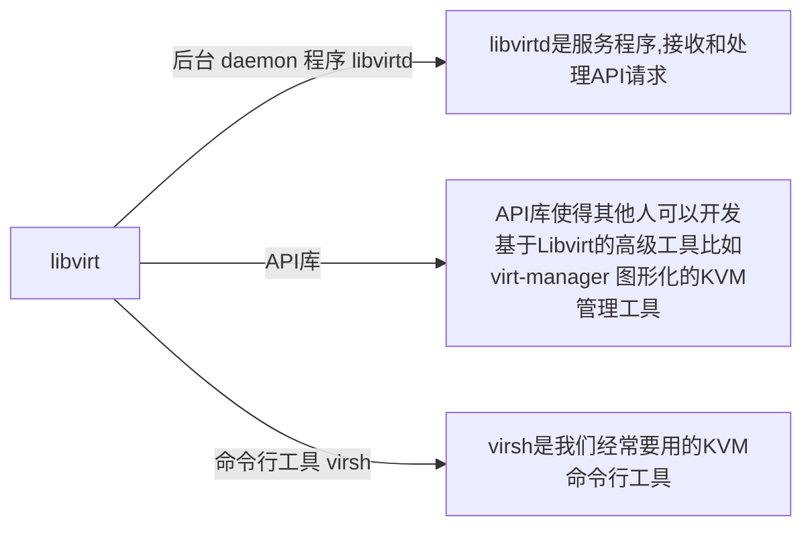

# 1. 虚拟化

虚拟化是云计算的基础。简单的说，虚拟化使得在一台物理的服务器上可以跑多台虚拟机，虚拟机共享物理机的 CPU、内存、IO 硬件资源，但逻辑上虚拟机之间是相互隔离的。


物理机我们一般称为宿主机（Host），宿主机上面的虚拟机称为客户机（Guest）。  

那么 Host 是如何将自己的硬件资源虚拟化，并提供给 Guest 使用的呢？

这个主要是通过一个叫做 Hypervisor 的程序实现的。

根据 Hypervisor 的实现方式和所处的位置，虚拟化又分为两种：1型虚拟化和2型虚拟化。 

## 1.1 **1型虚拟化**


Hypervisor 直接安装在物理机上，多个虚拟机在 Hypervisor 上运行。Hypervisor 实现方式一般是一个特殊定制的 Linux 系统。Xen 和 VMWare 的 ESXi 都属于这个类型。

1型虚拟化一般对硬件虚拟化功能进行了特别优化，性能上比2型要高


## 1.2 **2型虚拟化**


物理机上首先安装常规的操作系统，比如 Redhat、Ubuntu 和 Windows。Hypervisor 作为 OS 上的一个程序模块运行，并对管理虚拟机进行管理。KVM、VirtualBox 和 VMWare Workstation 都属于这个类型。


2型虚拟化因为基于普通的操作系统，会比较灵活，比如支持虚拟机嵌套。嵌套意味着可以在KVM虚拟机中再运行KVM。


# 2. kvm 

KVM ------------ **Kernel-Based Virtual Machine**    (基于内核的虚拟机) 

KVM 是基于 Linux 内核实现的。

KVM有一个内核模块叫 kvm.ko      只用于管理虚拟 CPU 和内存。

Linux 内核和qemu  						负责  IO 的虚拟化


# 3. libvirt 

**KVM 的管理工具**

libvirt 除了能管理 kvm 这种 Hypervisor，还能管理 Xen，VirtualBox 等





# 4.  qemu kvm  qume-kvm  libvirt openstack的区别和关系。 

## 4.1 qemu

```
qemu是独立的虚拟化解决方案，通过intel-VT/AMD SVM实现全虚拟化。
qemu可以不依赖kvm，也可以通过kvm提供的功能提升性能。 
```


## 4.2 kvm 

```
 kvm内核模块只能提供CPU和内存虚拟化，所以必须配合qemu才能构成完整的虚拟化技术，即qemu-kvm 
```


## 4.3 qemu-kvm 

```
一个完整的模拟器，它是构建基于kvm上面的，它提供了完整的网络和I/O支持。

qemu将kvm整合进来，通过 ioctl 调用/dev/kvm接口，将cpu指令相关部分交给内核模块来做。 
kvm负责CPU和内存虚拟化，但不能模拟其他设备。
qemu模拟IO设备（网卡，磁盘等）, 配合才能实现完整的服务器虚拟化。 

qemu模拟的其他硬件，会影响这些设备的性能，于是产生了 pass through半虚拟化设备 virtio_blk, virtio_net ，用于提升设备性能。 
```


 

## 4.4 libvirt 

```
作为虚拟机和云管理的中间层（抽象管理层）：提供各种API，供上层管理不同的虚拟机。 

libvirt是管理虚拟机及其他虚拟化功能（存储、网络…)的软件集合.

libvirt构建于一个抽象概念之上，为受支持的虚拟机监控程序实现的常用功能提供通用的API。 

提供了跨VM平台的功能，它可以控制除了qemu之外的模拟器，包括vmware, virtualbox, xen等。

为了openstack的跨VM性，openstack只会用libvirt而不直接用qemu-kvm。libvirt还提供了一些高级的功能，例如pool/volume管理
```


##  4.5 OpenStack

```
OpenStack不会直接控制qemu-kvm，它会用libvirt库去间接控制qemu-kvm
```


# 5 参考文档

https://www.cnblogs.com/CloudMan6/tag/OpenStack/