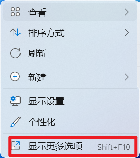
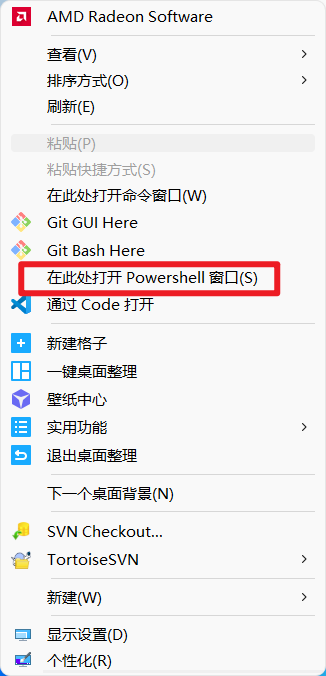
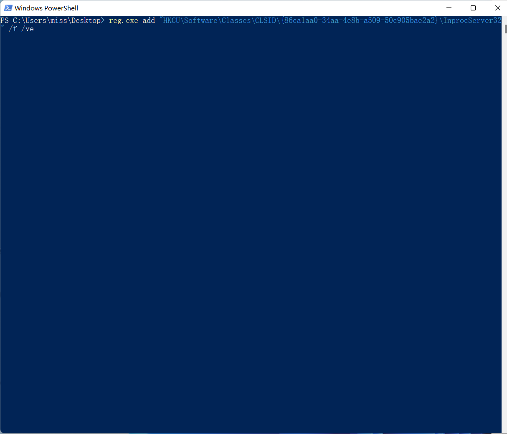
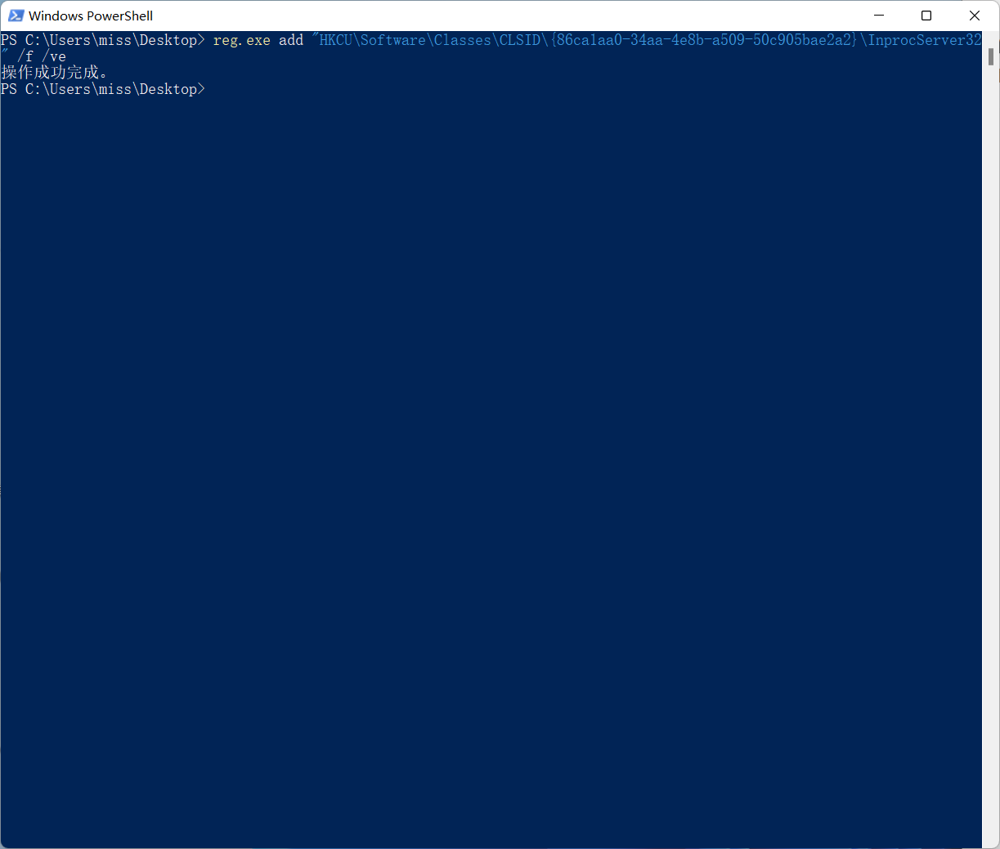
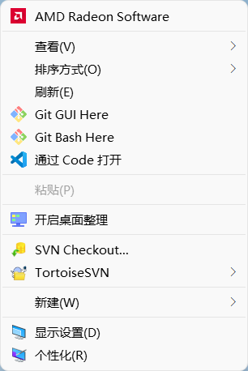

# 修改为Win10右键菜单

按住SHIFT+右键，点击显示更多选项，选择在此处打开Powershell窗口






输入以下命令，回车确认



```
reg.exe add "HKCU\Software\Classes\CLSID\{86ca1aa0-34aa-4e8b-a509-50c905bae2a2}\InprocServer32" /f /ve
```




重启电脑后，恢复成win10风格




# **恢复Win11新右键菜单**

按住SHIFT+右键，选择在此处打开Powershell窗口，输入以下代码即可

```
reg.exe delete "HKCU\Software\Classes\CLSID\{86ca1aa0-34aa-4e8b-a509-50c905bae2a2}\InprocServer32" /va /f
```

